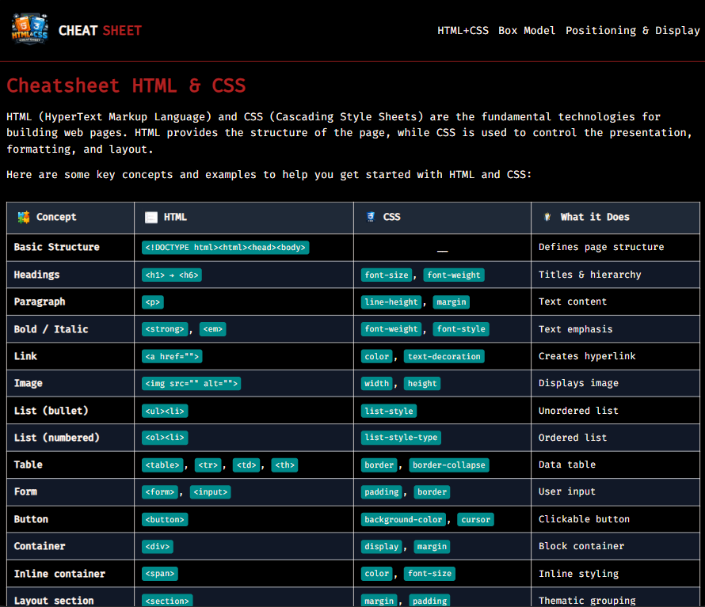
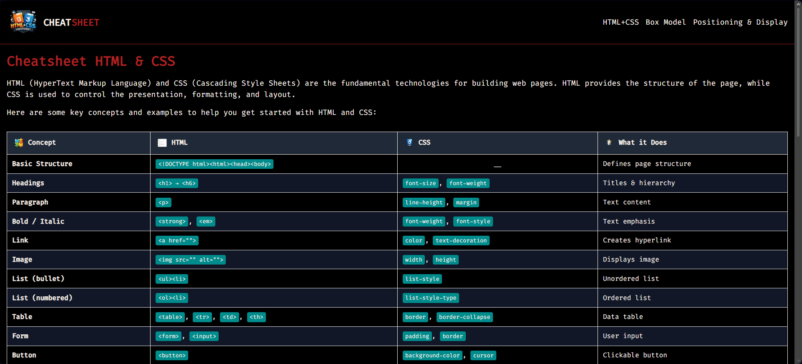

<p align="center">
  
</p>

<h1 align="center">📘 HTML & CSS Cheatsheet</h1>

<p align="center">
  A simple reference website that summarizes essential <b>HTML</b> and <b>CSS</b> concepts for beginners learning web development.
</p>

<p align="center">
  
  
  
  
</p>

<p align="center">
  
  
</p>

<p align="center">
  <a href="https://amirabenameur3.github.io/html_css_cheatsheet/">
  
  </a>
</p>

---

# 📖 Project Overview

This project is a **visual cheatsheet website** designed to help beginners quickly understand core **HTML and CSS concepts**.

The page organizes key web development concepts into easy-to-read sections, making it useful as a **quick reference while coding**.

The cheatsheet focuses on three main areas:

- **HTML & CSS fundamentals**
- **The CSS Box Model**
- **Positioning and display properties**

The goal was to build a **clean, readable, and responsive reference page** while practicing modern front-end development techniques.

---

## ✨ Features

- Responsive layout
- Flexbox navigation
- Clean and readable data tables
- Code formatting using **Fira Code**
- Zebra-striped tables for readability
- Hover effects for table rows
- Mobile-friendly design

---

## 🧰 Technologies Used

- **HTML5**
- **CSS3**
- **Flexbox**
- **Media Queries**
- **Google Fonts**

---

## 🎬 Demo

<p align="center">
  
</p>

---

## 📸 Website Sections

The cheatsheet is organized into clear sections:

### HTML Basics
Key HTML elements and structure examples.

### CSS Basics
Common CSS properties and styling fundamentals.

### The Box Model
Visual explanation of margin, border, padding, and content.

### Display & Positioning
Understanding `display`, `inline`, `block`, and positioning behavior.

---

## 📁 Project Structure

```
html_css_cheatsheet
│
├── index.html
├── README.md
├── html_css_cheatsheet.ico
│
├── docs
│   ├── cheatsheet_html_css_preview.png
│   └── demo.gif
│
└── resources
    ├── css
    │   └── styles.css
    │
    └── images
```

## 🧠 What I Learned

While building this project I practiced:

- Structuring semantic HTML
- Styling tables and code snippets
- Using **Flexbox** for layout
- Implementing **responsive design**
- Organizing files in a real project structure
- Writing clean and maintainable CSS

---

## 🚀 Future Improvements

Possible improvements for the project:

- Add **JavaScript interactive examples**
- Expand the cheatsheet with more **advanced CSS topics**
- Improve **accessibility**
- Add a **search feature** for faster reference

---

## 👩‍💻 Author

**Amira Ben Ameur**

PhD researcher in Structural & Transportation Engineering  
Front-End Development learner

GitHub  
https://github.com/amirabenameur3

---

## ⭐ If you like the project

Give the repository a **star on GitHub** ⭐
