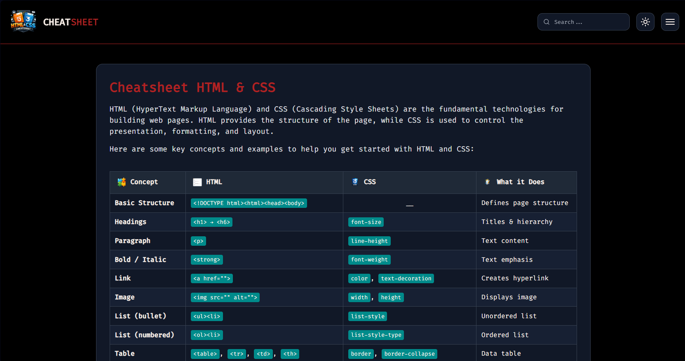
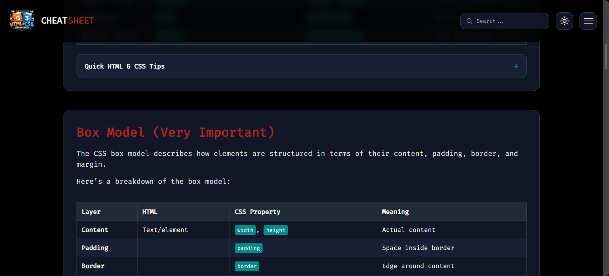

<p align="center">
  
</p>

<h1 align="center">📘 HTML & CSS Cheatsheet</h1>

<p align="center">
   An interactive and responsive <b>HTML & CSS developer cheatsheet</b> designed to help beginners quickly reference essential front-end concepts through clean UI components, searchable content, accordion sections, and copy-ready code examples.
</p>

<p align="center">
  
  
  
  
  
  
  
  
  
</p>

<p align="center">
  
  
</p>

<p align="center">
  <a href="https://amirabenameur3.github.io/html_css_cheatsheet/">
  
  </a>
</p>

---

# 📖 Project Overview

This project is an **interactive developer cheatsheet website** designed to help beginners quickly understand essential **HTML**, **CSS**, and responsive design concepts.

The cheatsheet organizes front-end development topics into structured and easy-to-read sections while providing modern interactive features such as:

- Real-time search filtering
- Accordion-based content organization
- Copy-ready code snippets
- Responsive mobile navigation
- Dark and light theme support

The goal of the project was to build a clean, responsive, and user-friendly developer reference page while practicing modern front-end development techniques using HTML, CSS, and JavaScript.

---

## 🌟 Highlights 
- 🔍 Interactive search system 
- 📂 Accordion-based documentation layout 
- 📋 Copy-to-clipboard functionality 
- 🌗 Dark / Light theme support 
- 📱 Responsive mobile-first navigation 

---

## 🌐 Live Demo

You can explore the live version of the website here:

👉 https://amirabenameur3.github.io/html_css_cheatsheet/

Deployed with **GitHub Pages**

---

## ✨ Features

- 🔍 Real-time search and filtering system
- 📂 Accordion-based collapsible sections
- 📋 One-click copy buttons for code snippets
- 🌗 Dark / Light theme support
- 📱 Fully responsive mobile design
- 🍔 Interactive mobile dropdown navigation
- 🎨 Modern UI using CSS variables
- ♿ Accessibility-focused semantic structure
- 🧭 Sticky navigation header
- ✨ Smooth hover and transition effects
- 🦓 Zebra-striped tables for readability
- 💻 Developer-friendly code formatting with Fira Code

---

## 🧰 Technologies Used

- **HTML5**
- **CSS3**
- **JavaScript (ES6)**
- **Flexbox**
- **Media Queries**
- **CSS Variables**
- **Google Fonts**

---

## 🎬 Demo

<p align="center">
  
</p>

---

## 📸 Website Sections

The cheatsheet is organized into multiple developer-focused sections:

### HTML Basics
Key HTML elements and structure examples.

### CSS Basics
Common CSS properties and styling fundamentals.

### Box Model
Visual explanation of margin, border, padding, and content.

### Flexbox
Modern layout techniques using Flexbox.

### Responsive Design
Media queries and mobile-friendly design concepts.

### CSS Selectors
Common selector patterns and targeting methods.

### Accessibility
Semantic HTML and accessibility best practices.

### Positioning & Display
Understanding layout positioning and display behavior.

---

## ⚡ Interactive Features

### 🔍 Search System
Instantly filter cheatsheet content in real time.

### 📂 Accordion Sections
Expand and collapse sections for better readability and navigation.

### 📋 Copy Buttons
Quickly copy code examples with one click.

### 🌗 Theme Toggle
Switch between dark and light modes.

### 📱 Mobile Navigation
Responsive dropdown navigation optimized for smaller screens.

---

## ♿ Accessibility

This project includes accessibility-focused improvements such as:

- Semantic HTML structure
- ARIA labels for interactive components
- Accessible mobile navigation
- Improved readability and spacing
- Responsive layouts for different screen sizes
- Keyboard-friendly interactions

---

## 📁 Project Structure

```
html_css_cheatsheet
│
├── index.html
├── README.md
├── html_css_cheatsheet.ico
├── main.js
│
├── docs
│   ├── cheatsheet_html_css_preview.png
│   └── demo.gif
│
└── resources
    ├── css
    │   └── styles.css
    │
    └── images

```

---

## 🧠 What I Learned

While building this project I practiced:

- Semantic and accessible HTML structure
- Writing scalable and maintainable CSS
- Responsive UI and mobile-first design
- JavaScript DOM manipulation and interactivity
- Dynamic search and filtering systems
- Accordion component implementation
- Copy-to-clipboard functionality
- Responsive navigation systems
- UI/UX improvements for usability and readability
- Organizing files in a real-world project structure

---

## 🚀 Future Improvements

Possible future improvements for the project:

- Add syntax highlighting for code examples
- Add category-based filtering
- Add keyboard shortcuts for navigation
- Convert the project into a multi-page documentation website
- Add interactive mini playground examples
- Store theme preference using localStorage
- Add animations using the Intersection Observer API

---

## 👩‍💻 Author

**Amira Ben Ameur**

PhD researcher in Structural & Transportation Engineering  
Front-End Development learner

### Connect With Me

- GitHub: https://github.com/amirabenameur3

---

## ⭐ If you like the project

Give the repository a **star on GitHub** ⭐
